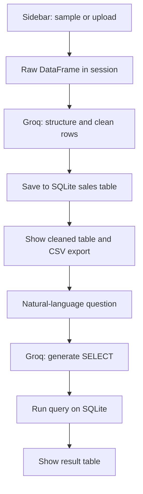

# AI Data Analyser

[](https://github.com/MiroslavKocian/AI-Data-Analyser/actions/workflows/test.yml)

Upload messy Excel sales exports, let **Groq** clean and structure the rows, store
them in **SQLite**, export CSV, and ask questions in plain language that become
**SQL** queries.

Built with Python 3.11, Streamlit, Groq (`openai/gpt-oss-20b`), pandas, and SQLite.

**Live demo:** [ai-sales-analyser.streamlit.app](https://ai-sales-analyser.streamlit.app/)  
(Hosted app name is `ai-sales-analyser`; the title in the UI is **AI Data Analyser**.)

## Requirements

- [Python 3.11](https://www.python.org/downloads/)
- [Git](https://git-scm.com/downloads)
- Free [Groq API key](https://console.groq.com) (for AI cleaning and SQL generation)
- [Docker Desktop](https://www.docker.com/products/docker-desktop/) (only if you want to run the app in Docker)

## Run locally

### 1. Download the project

```sh
git clone https://github.com/MiroslavKocian/AI-Data-Analyser.git
cd AI-Data-Analyser
```

This creates a folder named `AI-Data-Analyser`. Run every following command inside this folder.

### 2. Install dependencies

Windows (PowerShell):

```powershell
python -m venv .venv
.\.venv\Scripts\Activate.ps1
pip install -r requirements.txt
```

For development (tests, Ruff, same as CI):

```powershell
pip install -r requirements-dev.txt
```

macOS / Linux runtime:

```bash
python3 -m venv .venv
source .venv/bin/activate
pip install -r requirements.txt
```

For development:

```bash
pip install -r requirements-dev.txt
```

If PowerShell refuses to run `Activate.ps1`, run this once and try again:

```powershell
Set-ExecutionPolicy -Scope CurrentUser RemoteSigned
```

### 3. Set the Groq API key

Use **either** a root `.env` file **or** Streamlit secrets. If both exist locally,
`.env` wins.

**Option A — `.env` in the project root**

```env
GROQ_API_KEY="your_groq_api_key_here"
```

**Option B — `.streamlit/secrets.toml`**

```toml
GROQ_API_KEY = "your_groq_api_key_here"
```

Never commit real keys. `.env` and `secrets.toml` are in `.gitignore`.

For [Streamlit Cloud](https://share.streamlit.io): **Settings** → **Secrets** → set
`GROQ_API_KEY`, then **Reboot** the app after changes.

### 4. Start the app

```sh
python run_app.py
```

Equivalent:

```sh
python -m streamlit run main.py
```

Keep this terminal window open. The app runs as long as it is open. To stop it, press **Ctrl+C**.

On Windows, prefer `python -m streamlit` (not bare `streamlit`) so the active `.venv` is used.

### 5. Use the app

1. Open [http://127.0.0.1:8501](http://127.0.0.1:8501) in your browser.

   

2. In the sidebar, click **Load sample data** (uses `examples/messy_sales_example.xlsx`), **or** upload your own `.xlsx` file.

   

3. Review the **Raw input** table, then click **Run AI process** in the sidebar.

   

4. When cleaning finishes, download **CSV**, or type a question under **AI SQL analyst** and run the generated query. Generated SQL is validated as a **read-only `SELECT`** before it runs (see [Security note](#security-note)).

   

The sample file path on disk:

`examples/messy_sales_example.xlsx`

Each new upload or sample load replaces the working dataset in the UI session. The SQLite file on disk is updated when **Run AI process** finishes.

## Run with Docker

Create `.env` in the project root with `GROQ_API_KEY`, then start Docker Desktop and run:

```sh
docker compose up --build
```

When the log shows that Streamlit is listening on port 8501, follow the steps in [Use the app](#5-use-the-app). The log may say `http://0.0.0.0:8501`; that is the address inside the container. In your browser, use [http://127.0.0.1:8501](http://127.0.0.1:8501).

To stop, press **Ctrl+C** (on Windows, press **Enter** if the prompt hangs), then run:

```sh
docker compose down
```

The database file lives inside the container, so after `docker compose down` stored rows are gone. Load the sample or upload again after the next start.

## Excel file rules

- The file must be `.xlsx` (sidebar upload and sample loader).
- Messy real-world exports are expected: odd date formats, text in numeric fields, blanks.
- The app reads the sheet with pandas; very large files may hit Groq rate limits because cleaning runs in batches (see `BATCH_SIZE` in `config.py`).
- AI cleaning and the SQL analyst need a valid `GROQ_API_KEY`. Without it, the app stops with a clear error.

If upload or parsing fails, fix the file or try the sample workbook first.

## What **Run AI process** does

Clicking the sidebar button sends your **Raw input** table to **Groq** in batches
(`BATCH_SIZE` in `config.py`, currently **10 rows** per API call). The model must
answer with JSON; the app keeps the **same column names** as your Excel headers,
merges all batches, writes the result to SQLite, and shows **Cleaned data**.

The cleaning instructions (from `build_cleaning_prompt` in `ai_provider.py`) are:

1. Return a JSON object with a single key `records`: a list of row objects.
2. Every row must use the **exact column keys** from the upload (no renames).
3. **Date-like columns** — parse to `YYYY-MM-DD`; use JSON `null` when the value
   is invalid or missing.
4. **Numeric columns** — remove currency symbols and units, keep the number only
   (for example `1200 USD` → `1200`, `5 pieces` → `5`); use `null` when not numeric
   or missing.
5. **All other columns** — treat empty sentinels (`N/A`, `n/a`, `-`, blank) as
   `null`; **do not** guess, invent, or reformat values beyond that.

Before each batch is sent, cells like `N/A` / `nan` are normalized to empty strings
so the model sees the same messiness you see in **Raw input**. Temperature is **0**
and the API uses **JSON object** mode so the reply is machine-parseable.

The **AI SQL analyst** (step 4) is a separate Groq call: natural language →
`SELECT` for table `sales`. Prompt rules are listed in
[docs/architecture.md](docs/architecture.md#llm-sql-analyst-rules).

## How it works



1. Excel is loaded into Streamlit session state (sample file or upload).
2. **Run AI process** sends batches of rows to Groq using the rules above.
3. Cleaned data is saved to `sales_intelligence.db` and shown in the UI.
4. The SQL analyst asks Groq for a `SELECT`, runs it locally, and displays rows.

| File | Responsibility |
|------|----------------|
| `main.py` | Streamlit entry script (imports `ai_data_analyser.app`) |
| `run_app.py` | Launches `python -m streamlit run main.py` |
| `quality_gate.py` | Optional local runner: Ruff + pytest (same as CI) |
| `ai_data_analyser/app.py` | Page flow (ingest → clean → analyse) |
| `ai_data_analyser/ui_renderer.py` | Streamlit widgets and layout |
| `ai_data_analyser/startup.py` | Resolve `GROQ_API_KEY` from `.env` or secrets |
| `ai_data_analyser/ai_provider.py` | Groq calls for cleaning and SQL generation |
| `ai_data_analyser/pipeline_manager.py` | Clean → persist → session state |
| `ai_data_analyser/repository.py` | Write cleaned frames to SQLite |
| `ai_data_analyser/sql_runner.py` | Validate and run read-only `SELECT` queries |
| `ai_data_analyser/state_manager.py` | Session state helpers |
| `ai_data_analyser/sample_loader.py` | Load `examples/messy_sales_example.xlsx` |
| `ai_data_analyser/data_transformer.py` | Display-safe formatting |
| `ai_data_analyser/config.py` | Paths, model name, batch size, DB table name |

For a longer walkthrough (request flow, key functions per module, and design notes),
see [docs/architecture.md](docs/architecture.md).

Files created while the app runs (not stored in Git): `sales_intelligence.db` in the project root (or inside the container when using Docker).

## Security note

The **AI SQL analyst** sends model-generated SQL to `ai_data_analyser/sql_runner.py`, which **enforces**
read-only access before anything hits SQLite:

- Only a **single** statement is allowed (no `;` chains).
- The statement must be **`SELECT`** (optional leading **`WITH`** CTE).
- **Mutating keywords** are rejected (`DROP`, `DELETE`, `UPDATE`, `INSERT`, `ALTER`,
  `CREATE`, `ATTACH`, `PRAGMA`, and similar).
- Comments are stripped and whitespace is normalized before validation.
- The database is opened with SQLite **`mode=ro`** (read-only URI).

Invalid SQL shows a clear **Streamlit error** in the UI; it is never executed. This
remains a **portfolio demo** — production would add stronger parsing, allow-lists, and
query limits.

## Development and quality

| Topic | Where it lives |
|--------|----------------|
| Application code | Python package `ai_data_analyser/` (Streamlit UI, Groq, SQLite) |
| Runtime install | `pip install -r requirements.txt` |
| Dev / CI install | `pip install -r requirements-dev.txt` (adds pytest, pytest-cov, Ruff) |
| Lint rules | `pyproject.toml` — Ruff `E`, `F`, `I`, `B`, `UP`, line length 88 |
| Tests on app start | **No** — run `pytest` or `python quality_gate.py` yourself; GitHub Actions on every push |
| SQL analyst safety | `ai_data_analyser/sql_runner.py` — validated read-only `SELECT` only ([Security note](#security-note)) |
| Deep dive | [docs/architecture.md](docs/architecture.md) |

Starting the app (`python run_app.py`) only launches Streamlit. Press **Ctrl+C** to stop.
On Windows, Streamlit may print harmless asyncio/thread messages while shutting down.

## Tests

With the virtual environment active:

```sh
pytest
ruff check .
ruff format --check .
```

`pytest` runs all tests and requires 100% code coverage. Ruff enforces style and imports
(`E`, `F`, `I`, `B`, `UP` in `pyproject.toml`).

GitHub runs the same three commands automatically after every push (file `.github/workflows/test.yml`). The green **Tests** badge at the top of this page shows the latest result.

Optional: run all three in one step with `python quality_gate.py`.

## Project structure

```text
AI-Data-Analyser/
├── main.py
├── run_app.py
├── quality_gate.py
├── ai_data_analyser/
│   ├── app.py
│   ├── ai_provider.py
│   ├── config.py
│   ├── data_transformer.py
│   ├── pipeline_manager.py
│   ├── repository.py
│   ├── sample_loader.py
│   ├── sql_runner.py
│   ├── startup.py
│   ├── state_manager.py
│   └── ui_renderer.py
├── examples/
│   └── messy_sales_example.xlsx
├── docs/
│   ├── architecture.md
│   └── images/
│       ├── 01-app-home.jpg
│       ├── 02-raw-input.jpg
│       ├── 03-cleaned-data.jpg
│       └── 04-sql-analyst.jpg
├── tests/
├── .github/workflows/test.yml
├── Dockerfile
├── compose.yaml
├── requirements.txt
├── requirements-dev.txt
├── pyproject.toml
└── AGENTS.md
```

`pyproject.toml` holds the pytest and Ruff settings. `AGENTS.md` holds the coding rules followed while building this project.

## Troubleshooting

| Problem | Solution |
|---------|----------|
| Browser says the page cannot be reached | The app is not running. Start it with `python run_app.py` and keep the terminal open. |
| `Address already in use` / port 8501 busy | Another app (or a second copy of this one) is using port 8501. Close it and start again. |
| `GROQ_API_KEY is missing` | Add the key to `.env` or `.streamlit/secrets.toml` (see [Set the Groq API key](#3-set-the-groq-api-key)). |
| **Run AI process** fails or times out | Check the Groq key, quotas at [console.groq.com](https://console.groq.com), and try a smaller upload or the sample file. |
| Upload shows an error | Confirm the file is `.xlsx` and readable; try [Excel file rules](#excel-file-rules) or the sample workbook. |
| Docker starts but the UI is empty / errors | Ensure `.env` with `GROQ_API_KEY` exists in the project root before `docker compose up --build`. |
| Messy log after **Ctrl+C** on Windows | Normal Streamlit shutdown noise; the app has stopped. Use `python run_app.py` again to restart. |

## License

No license is granted. The code is published to be viewed as a portfolio project.
